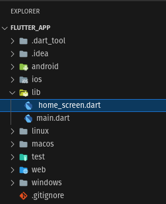
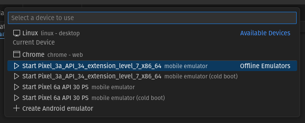
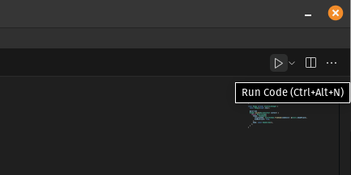
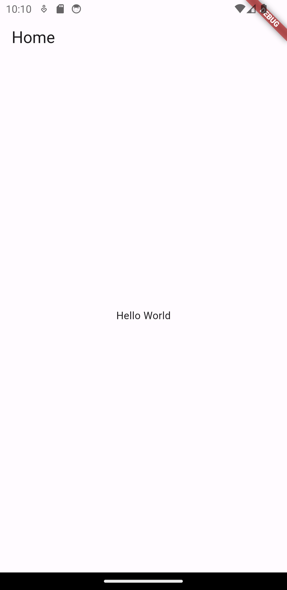
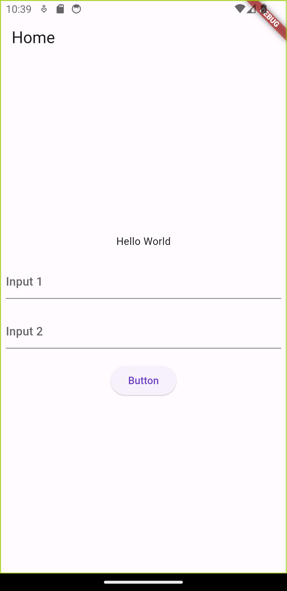

# Flutter Handover App
### System Requirement
- Windows 10 (64-bit)
- 16 GB RAM, SSD
- Android Studio
- OpenJDK: 17
- Flutter: 3.16.2  
- Dart: 3.2.2
---

### 1. Create a Flutter app
* Run in the terminal
  ```bash
  flutter create my_app
  ```

### 2. Create a new dart file inside [lib](./lib/) directory
<p align="center">
    
</p>

### 3. Inside the [home_screen.dart](./lib/home_screen.dart), create a stateless widget
```dart
class HomeScreen extends StatelessWidget {
  const HomeScreen({super.key});

  @override
  Widget build(BuildContext context) {
    return Scaffold(
      appBar: AppBar(
        title: const Text('Home'),
      ),
      body: const SizedBox(
        width: double.infinity,
        child: Column(
          mainAxisAlignment: MainAxisAlignment.center,
          children: [
            Text('Hello World'),
          ],
        ),
      ),
    );
  }
}
```

### 4. Change the [main.dart](./lib/main.dart) like below
```dart
void main() {
  runApp(const MyApp());
}

class MyApp extends StatelessWidget {
  const MyApp({super.key});

  @override
  Widget build(BuildContext context) {
    return MaterialApp(
      theme: ThemeData(
        colorScheme: ColorScheme.fromSeed(seedColor: Colors.deepPurple),
        useMaterial3: true,
      ),
      home: const HomeScreen(),
    );
  }
}
```

### 5. Run the emulator
<p align="center">
    
</p>

### 6. Run the app from play button at top right of the IDE
<p align="center">
    
</p>

### 7. After waiting for a while, emulator will run the app like below
<p align="center">
    </img>
</p>

### 8. Add two TextField in the [home_screen.dart](./lib/home_screen.dart)
* Learn more about textfields [here](https://docs.flutter.dev/cookbook/forms/text-input)
  ```dart
  TextField(
    controller: textFieldController1,
    decoration: const InputDecoration(hintText: 'Input 1'),
  ),
  const SizedBox(height: 20),
  TextField(
    controller: textFieldController2,
    decoration: const InputDecoration(hintText: 'Input 2'),
  ),
  const SizedBox(height: 20),
  ElevatedButton(
    onPressed: () {},
    child: const Text('Button'),
  ),
  ```

### 9. After saving the code, it will hot-reload and the emulator will look like this-
<p align="center">
    </img>
</p>

### 10. Build APK
* Run in the terminal
  ```bash
  flutter build apk
  ```
  The APK is stored in 'build/app/outputs/flutter-apk/' directory

### 11. Release APK
* In order to build and release apk to Google Play Store, you need to read the official documentation. As it gets updated from time to time.  
  Visit the link below to find more on this.

  [https://docs.flutter.dev/deployment/android](https://docs.flutter.dev/deployment/android)
